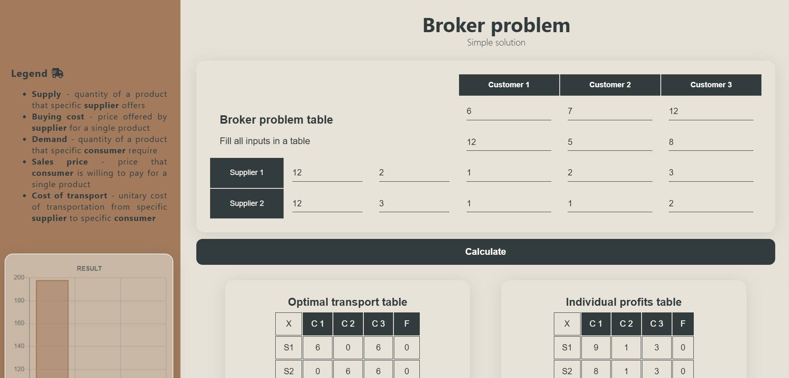

<!-- font awesome link -->
<link
      rel="stylesheet"
      href="https://cdnjs.cloudflare.com/ajax/libs/font-awesome/6.5.1/css/all.min.css"
      integrity="sha512-DTOQO9RWCH3ppGqcWaEA1BIZOC6xxalwEsw9c2QQeAIftl+Vegovlnee1c9QX4TctnWMn13TZye+giMm8e2LwA=="
      crossorigin="anonymous"
      referrerpolicy="no-referrer"
    />

# Broker problem <i class="fa-solid fa-truck-fast"></i>

### General Information

This web application project was developed as a assignment for the `Operational and Logistic Research` course at AGH University.

- To familiarize yourself with the details of the issue (_in Polish_) : **[docs](./docs/)**
- An algorithm solving the intermediary problem: **[middleman-calc-module](./middleman-calc-module/)**
- Frontend part of the application: **[client-module](./client-module/)**

### Animation shows roughly how application works:

### Technologies we used:

