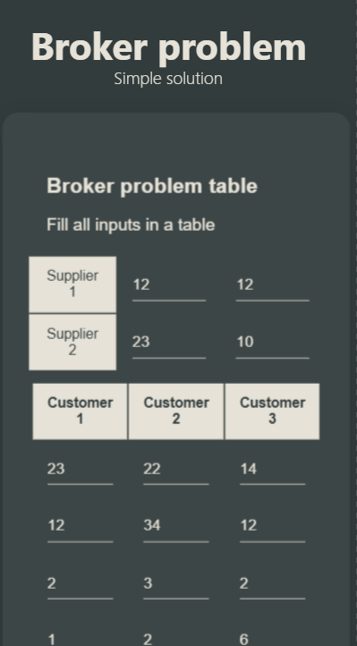
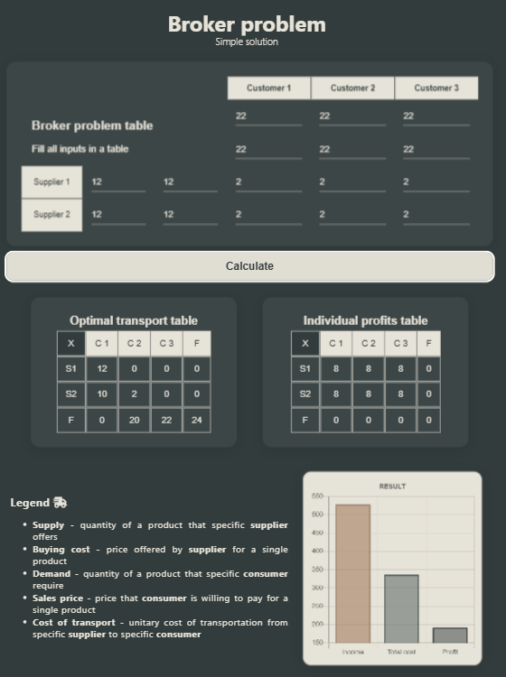

# Short description

### How to run:

- To run in development mode in Visual Studio Code simply use: [LiveServer](https://github.com/ritwickdey/vscode-live-server-plus-plus) extension.

- You can also use simple static HTTP server: [http-server](https://www.npmjs.com/package/http-server)

- Don't forget to run backend as well ( [click here](../middleman-calc-module/) )

### Responsive Layout:

**Phone:**

**Tablet:**

### What was used:

- **[Chart.js](https://www.chartjs.org/)**
- **[sweetalert2](https://sweetalert2.github.io/)**
- **[Font Awesome](https://fontawesome.com/)**

