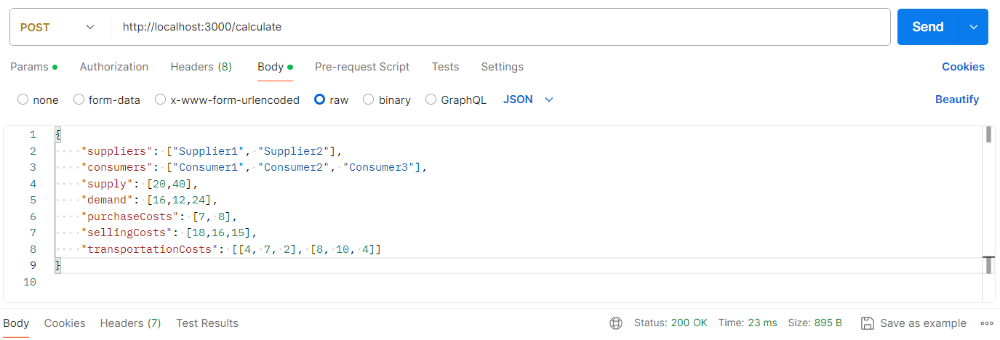

# Quick-start:

### 1. Run tests 

To run all defined tests of core functionality from [middleman-calc-module/__tests__/core.test.js](../middleman-calc-module/__tests__/core.test.js) use below command in main project catalogue:
```bash
npm test
```

### 2. Run node backend server

For using the endpoint `/calculate`, run the `node` server defined in [middleman-calc-module/service.js](servis.js) via npm script:
```bash
npm run backend
```
or if you want server in development mode use below command instead:
```bash
npm run backend-dev
```

### 3. Get response via Postman

To test the response you need to send `HTTP/POST` on `http://localhost:3000/calculate` address with following body formatted as raw json:
```json
{
    "suppliers": ["Supplier1", "Supplier2"],
    "consumers": ["Consumer1", "Consumer2", "Consumer3"],
    "supply": [20,40],
    "demand": [16,12,24],
    "purchaseCosts": [7, 8],
    "sellingCosts": [18,16,15],
    "transportationCosts": [[4, 7, 2], [8, 10, 4]]
}
```
It should look like below:



The response bode consists:
```json
{
    "allocationTable": [
        [16, 0, 4, 0],
        [0, 0, 20, 20],
        [0, 12, 0, 40]
    ],
    "allocationTableRealRoutes": [
        [16, 0, 4],
        [0, 0, 20]
    ],
    "unitProfits": [
        [7, 2, 6, 0],
        [2, -2, 3, 0],
        [0, 0, 0, 0]
    ],
    "steps": [
        {
            "preOptimizationTable": [
                [16, 0, 4, 0],
                [0, 12, 20, 8],
                [0, 0, 0, 52]
            ],
            "postOptimizationTable": [
                [16, 0, 4, 0],
                [0, 0, 20, 20],
                [0, 12, 0, 40]
            ],
            "deltas": [
              1, -3, -2, -4, 2, -3
            ],
            "deltaTable": [
                [null, 1, null, -3],
                [-2, null, null, null],
                [-4, 2, -3, null]
            ]
        },
        {
            "preOptimizationTable": [
                [16, 0, 4, 0],
                [0, 0, 20, 20],
                [0, 12, 0, 40]
            ],
            "postOptimizationTable": [
                [16, 0, 4, 0],
                [0, 0, 20, 20],
                [0, 12, 0, 40]
            ],
            "deltas": [
              -1, -3, -2, -2, -4, -3
            ],
            "deltaTable": [
                [null, -1, null, -3],
                [-2, -2, null, null],
                [-4, null, -3, null]
            ]
        }
    ],
    "totalCost": 452,
    "totalRevenue": 648,
    "intermediaryProfit": 196
}
```

Description of returned values:
- `allocationTable` - table of routes after end of an algorithm, includes fictitious actors (fictitious supplier and consumer),
- `allocationTableRealRoutes` - as above but only with real actors,
- `unitProfits` - profits on each route calculates as selling_price - (transportation_cost + purchase_cost),
- `steps` - steps of new optimized routes:
  - `preOptimizationTable` - routes before optimization in this step
  - `postOptimizationTable` - routes after
  - `deltas` - optimization indicators, 
  - `deltaTable` - deltas in tables
- `totalCost`
- `totalRevenue`
- `intermediaryProfit`


